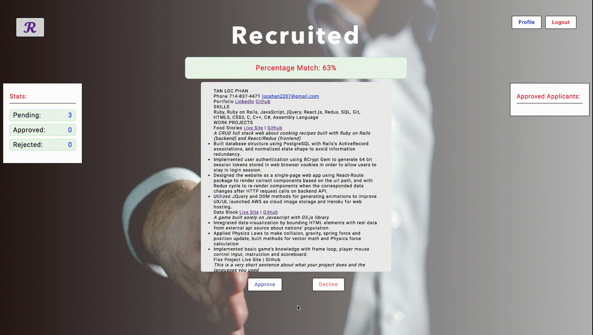

# Recruited

[Live](https://recruited.herokuapp.com/)

Recruited is a full-stack single page web application designed to combine the functionality of Tinder with the practicality of Indeed.com.

## Background and Overview

The allocation of highly talented workers and limited employment opportunities is never-ending.  In an attempt to simplify the process, this application is designed to pair recruiters and job seekers given the minimal amount of information.

## Technologies & Technical Challenges
 **Backend**: Express/Node.js   
 **Frontend**: React/JavaScript

## Functionality & MVP
  - [x] User authentication using Node/Express as the backend framework. (1 Day)
  - [x] Ability for job seekers to upload resumes and store onto MongoDB. (1 Day)
  - [x] Basic CRUD functionality on both job seeker and recruiter side. (1 Day)
  - [x] Parse submitted resumes to match job posting requirements. (1 Day)
  - [x] Allow recruiters/seekers to accept or reject resumes based on match criteria. (1 Day)

## Features
### Resume Uploading
User can apply for any job by uploading their resumes. The web app will convert Microsoft Word files into text and HTML and save it into the database for matching algorithm.


### Resume Approving
As a recruiter, user can go to their job listing to check for all resumes other users have applied. The page not only will show total number of pending, approved and rejected resumes, it also displays information of approved candidates.



In case there is no more pending resume, users can easily click on the approved applicants to review their resumes again.


### User personal page
Users can always visit their personal profile page to check which jobs they posted, or which jobs they submitted their resumes to.


## Our Matching Algorithm
With limited of time, we came up with an algorithm to show percentage match based on our keywords bank. Each job title will have its set of related keywords. Once a job is posted, the algorithm will take a look at its job title and get those keywords from the keywords bank. Then, it looks through the job's description, to see filter keywords which appear in that job's qualifications. From that, it will scan through each resume to check if there is any matched keywords, then calculate the percentage.

Here is a quick look of our keywords bank:

```JavaScript
module.exports = {
  fullstack: "Unix, REST API, jQuery, JSON, TDD, Ruby, MongoDB, Babel, Angular, Javascript, HTML5, Git, Flux, HTML, UX, Node, Redux, AWS, React, Java, CSS, Python, Ember, PHP, Nodejs, SQL, Redux, Node, Webpack, Redux, CSS3, Django, Rails, Sass, NoSQL, MySQL, ES6, MVC, redis, Emberjs, Docker, Linux, Boostrap, Linux, Reactjs",
  frontend: "Node, Github, jQuery, Django, PHP, nodejs, JSX, NPM, JSON, Mongo, AngularJS, Jest, TDD, Backbone, HTML5, Mocha, API, D3, SASS, D3, Meteorjs, Webpack, NoSQL, HTML, CSS, Javascript, Ember, SQL, ES6, Python, MongoDB, HTTP, AJAX, CSS3, Redux, REST, Rails, grunt, SCRUM, MySQL, MVC, VueJS",
  ...
```

A part of the algorithm:

```JavaScript
module.exports = (job, resumes) => {
  // call the function to gather all the keywords related to this job title:
  let thisJobKeywords = getThisJobKeywords(job);
  let dupResumes = _.merge([], resumes); // dup, so we can modify

  if (thisJobKeywords.length < 1) { // handle if no keywords, return all 0 percentMatch
    dupResumes.forEach((resume, idx) => {
      dupResumes[idx].percentMatch = 0;
    });
    return dupResumes;
  }
  // check for matched keywords that the recruiters are looking for:
  dupResumes.forEach((resume, idx) => {
    let matchCount = 0;
    thisJobKeywords.forEach((keyword) => {
      if (resume.resumeText.includes(keyword)) matchCount ++;
    });

    dupResumes[idx].percentMatch = matchCount / thisJobKeywords.length;
  });
  return dupResumes;
};
```

#### Bonus Features
  - [ ] Websocket chat feature.

### Known bugs
* Percentage Match does not show when clicking on approved applicants right after it gets approved.

## Group Members & Work Breakdown

**Ling Kit Edward Cheng**,
**Kelvin Cho**,
**Tan Loc Phan**

### Daily Breakdown

#### Weekend
  - Hosted On Heroku
  - Complete Proposal

#### Day 1
  - User authentication and verify that all team members have work environment setup.
  - Begin CRUD functionality on backend.
  - Start frontend React/Redux for user auth, login/signup

#### Day 2
  - Create backend parsing algorithm
  - Start frontend containers and items for Jobs Index

#### Day 3
  - Ensure functionality on backend
  - Jobs Show page on frontend and Recruiters Show page

#### Day 4
  - Implement search/filter algorithm
  - Styling on frontend

#### Day 5
  - Finalize production level product / DRY code
